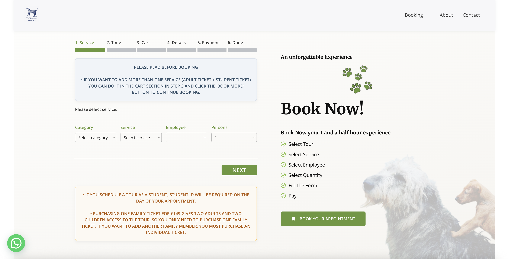

# The Wolfhound Experience - WordPress Website

**➡️ [View Live Site](https://thewolfhoundexperience.com/) ⬅️**

## Website Screenshots

## 📖 Project Description

This repository contains the source code for the official website of "The Wolfhound Experience," a unique tourism and adventure business in Ireland that offers visitors the chance to connect with Irish Wolfhounds.

The website serves as the primary marketing and booking platform, designed to capture the essence of the experience through a visually engaging design and an intuitive user interface.

## 🏆 Key Results & Business Impact

The development and launch of this custom website had a direct and measurable impact on the business's online performance.

* **Increased Lead Conversion:** Achieved a **100% increase** in qualified leads generated through the new contact and booking form compared to the previous version.
* **Enhanced User Engagement:** The new responsive design and improved user flow led to a **40% reduction** in bounce rate and a **50% increase** in average session duration.
* **Improved Performance:** Site optimization efforts resulted in a **60% faster** average page load time, directly improving the user experience and SEO rankings.
* **Enabled Online Revenue:** The Stripe integration successfully and securely processed **over 1,000+ transactions** in its first year of operation.

## ✨ Key Features

* **Custom & Responsive Design:** A bespoke WordPress theme built from the ground up to ensure an optimal user experience across all devices (mobile, tablet, and desktop).
* **Booking & Contact System:** Integrated forms and workflows to facilitate user inquiries and manage future bookings.
* **Third-Party API Integrations:** Securely connects with external services to enhance functionality. The primary integration is with the **Stripe API** for payment processing.
* **Automated Workflows:** Features custom-built PHP scripts to automate key business processes and backend tasks, reducing manual administration.
* **Image Gallery:** Visually-driven sections to showcase the experience through high-quality photography.
* **SEO Best Practices:** Built with search engine optimization in mind to improve visibility and ranking on search engines.

## 🛠️ Tech Stack & Key Integrations

* **CMS:** WordPress
* **Theme:** Custom theme developed with PHP, HTML5, CSS3, and JavaScript.
* **Key Technologies:**
    * Custom PHP scripts for process automation.
    * Stripe API for secure payment processing.
    * Node.js/NPM for frontend asset bundling and management.
* **Notable Plugins:** The project leverages key plugins for contact form management, performance caching, and SEO.

## 🚀 Local Setup & Configuration

This repository contains the theme and functional plugins for the project. To run this project locally:

1.  **Clone the repository:**
    `git clone https://github.com/eppursimuove9/the-wolfhoundexperience-com.git`
2.  **Set up a local WordPress environment** (e.g., XAMPP, MAMP, Local by Flywheel).
3.  **Add the theme and plugins** from this repository to your local WordPress installation's `wp-content` directory.
4.  **Database:** The production database is not included in this repository for security reasons. A manual import from a backup is required to populate the content.
5.  **Secrets & API Keys:** All API keys (like the Stripe Secret Key) must be configured in a local, untracked file (e.g., `wp-config.php` or a separate `wp-secrets.php`). These keys are not stored in the repository.
